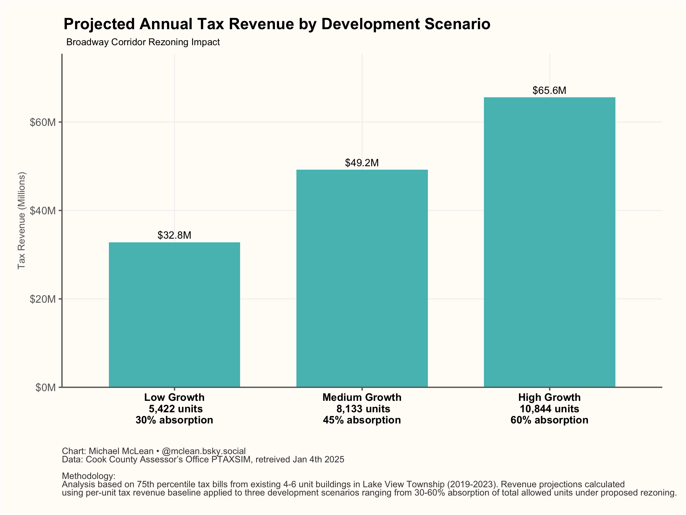

Lake View Township Broadway Corridor Rezoning Analysis
================
Cook County Potential
January 06, 2025

## Lake View Township Market Value Analysis

First, let’s analyze the current property values in Lake View Township,
focusing on class 206 (4-6 unit) apartment buildings from 2019-2023, as
these will serve as our baseline for per-unit tax revenue.

``` r
# Query Lake View township properties (2019-2023) with focus on class 206
query <- "
WITH pin_averages AS (
  SELECT 
    pin,
    class,
    AVG(av_clerk) as avg_assessed_value,
    AVG(tax_bill_total) as avg_tax_bill,
    CASE
      WHEN class = '206' THEN 5    -- Assuming 5 units for class 206
      ELSE 1
    END as estimated_units
  FROM pin
  WHERE substr(tax_code_num, 1, 2) = '73'  -- Lake View township
    AND year >= 2019 
    AND year <= 2023
    AND class = '206'  -- Focus on 4-6 unit buildings
  GROUP BY pin, class
),
percentile_calc AS (
  SELECT 
    class,
    avg_assessed_value,
    avg_tax_bill,
    estimated_units,
    NTILE(4) OVER (PARTITION BY class ORDER BY avg_tax_bill) as quartile
  FROM pin_averages
)
SELECT 
  class,
  COUNT(*) as total_properties,
  AVG(CASE WHEN quartile = 4 THEN avg_tax_bill END) as p75_tax_bill,
  AVG(avg_tax_bill) as mean_tax_bill,
  MAX(estimated_units) as units_per_building
FROM percentile_calc
GROUP BY class
"

# Execute query and format results
property_stats <- DBI::dbGetQuery(ptaxsim_db_conn, query) %>%
  mutate(
    property_type = "4-6 Unit Building",
    # Calculate per-unit values
    p75_value_per_unit = p75_tax_bill / units_per_building,
    mean_value_per_unit = mean_tax_bill / units_per_building
  )

# Display the results
property_stats %>%
  select(
    property_type,
    total_properties,
    p75_value_per_unit,
    mean_value_per_unit,
    units_per_building
  ) %>%
  mutate(
    p75_value_per_unit = scales::dollar(p75_value_per_unit),
    mean_value_per_unit = scales::dollar(mean_value_per_unit)
  ) %>%
  kable(
    col.names = c(
      "Property Type",
      "Total Properties",
      "75th Percentile Tax Bill (per unit)",
      "Mean Tax Bill (per unit)",
      "Units per Building"
    ),
    caption = "Lake View Township Class 206 Property Statistics (2019-2023 Averages)"
  )
```

| Property Type | Total Properties | 75th Percentile Tax Bill (per unit) | Mean Tax Bill (per unit) | Units per Building |
|:---|---:|:---|:---|---:|
| 4-6 Unit Building | 2114 | \$6,051.09 | \$4,183.80 | 5 |

Lake View Township Class 206 Property Statistics (2019-2023 Averages)

### Key Findings from Market Value Analysis

1.  **Property Analysis**: We analyzed existing 4-6 unit apartment
    buildings (class 206) in Lake View Township, assuming an average of
    5 units per building, to establish a baseline for per-unit tax
    revenue.

2.  **Tax Revenue Patterns**: The 75th percentile tax bills per unit for
    class 206 buildings show the revenue potential for new development:

    - Per Unit Tax Bill:
      $`{format_currency(property_stats`$p75_value_per_unit)}

3.  **Building Scale**: While our baseline is derived from 5-unit
    buildings, new construction along Broadway may vary in size based on
    lot dimensions and zoning allowances.

## Broadway Corridor Rezoning Analysis

This analysis examines the potential property tax revenue impact of
rezoning the Broadway corridor between Devon and Montrose in Lake View
Township. The proposed rezoning would increase the allowed units from
8,874 to 18,073 units.

## Development Scenarios

We’ll analyze three scenarios based on different absorption rates of the
total allowed capacity:

1.  30% of allowed capacity (5,422 units)
2.  45% of allowed capacity (8,133 units)
3.  60% of allowed capacity (10,844 units)

For each scenario, we’ll use the 75th percentile tax bill per unit from
Lake View Township class 206 buildings as our baseline per-unit revenue.

| Scenario      | Total Units | Annual Tax Revenue |
|:--------------|:------------|:-------------------|
| Low Growth    | 5,422       | \$32,809,006       |
| Medium Growth | 8,133       | \$49,213,508       |
| High Growth   | 10,844      | \$65,618,011       |

Projected Annual Tax Revenue by Development Scenario

<!-- -->

## Key Findings

The analysis shows that rezoning could generate significant tax revenue
while staying well below maximum capacity:

1.  Even at 30% absorption (5,422 units), the corridor would generate
    substantial new tax revenue
2.  Medium growth at 45% (8,133 units) balances revenue potential with
    manageable growth
3.  High growth at 60% (10,844 units) maximizes revenue while
    maintaining 40% capacity buffer

Revenue estimates use 75th percentile tax bills from existing 4-6 unit
buildings as baseline.

``` r
# Close database connection
DBI::dbDisconnect(ptaxsim_db_conn)
```
